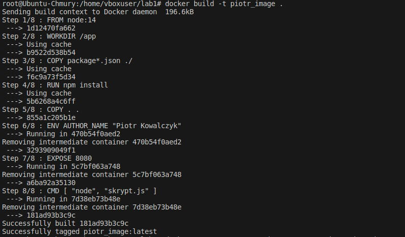
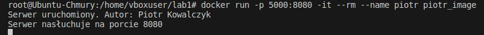
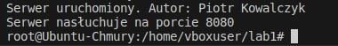
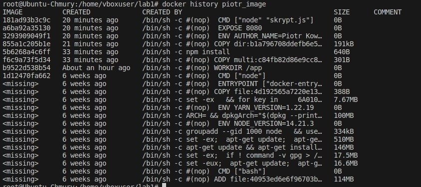

# Piotr Kowalczyk Lab1
## Zad 3
### a) Tworzenie obrazu kontenera :  
    docker build -t piotr_image .
    
    
  
### b) Uruchomienie kontenera na podstawie obrazu utworzenonego w podpunkcie a)  
    docker run -p 5000:8080 -it --rm --name piotr piotr_image

### c) Sprawdzanie co zostało wygenerowane przez uruchomiony kontener należy otworzyć drugi terminal oraz użyć polecenia:  
    docker logs piotr
  

### d) Sprawdzanie ilości warst posiadanych przez obraz można wykonać poleceniem:  
    docker history piotr_image
     
